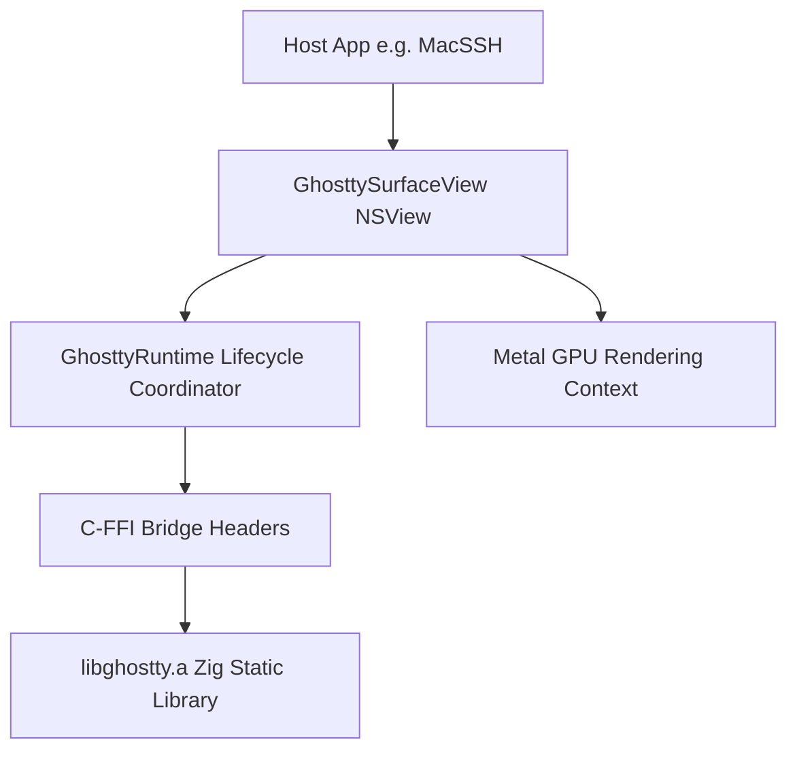

# System architecture

```mermaid
graph TD
    App[Host App e.g. MacSSH] --> Surface[GhosttySurfaceView NSView]
    Surface --> Runtime[GhosttyRuntime Lifecycle Coordinator]
    Runtime --> FFI[C-FFI Bridge Headers]
    FFI --> ZigCore[libghostty.a Zig Static Library]
    Surface --> Metal[Metal GPU Rendering Context]
```
