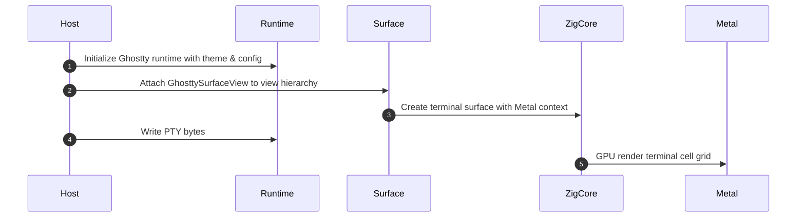

# Key flows

```mermaid
sequenceDiagram
    autonumber
    Host->>Runtime: Initialize Ghostty runtime with theme & config
    Host->>Surface: Attach GhosttySurfaceView to view hierarchy
    Surface->>ZigCore: Create terminal surface with Metal context
    Host->>Runtime: Write PTY bytes
    ZigCore->>Metal: GPU render terminal cell grid
```
